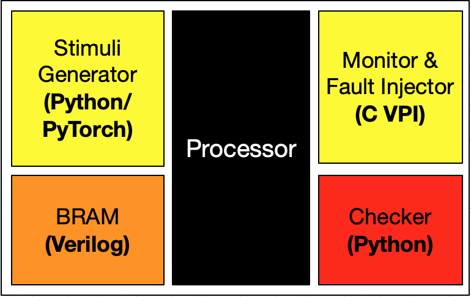

This project is targeting some critical paths of the core and trying to sensitize them using guided stimuli generator, in order to activate potential defect-induced Path Delay Faults (PDFs) that lie within. The core monitor, implemented using Verilog Program Interface (VPI), would feed the switching activity of the target PDFs back to the learning engine of the generator. Reinforcement Learning (RL) is now adopted as our learning strategy. 

This Project is currently under development. 

## Getting Started
Download & Install: 
```
$ git clone https://github.com/xeniacjen/StimuliGen --branch gb --single-branch
```

First, extract the PDFs of the circuits: 
```
$ cd StimuliGen/Hardware/verilog 
$ make run 
```

Run simulation: 
```
$ cd StimuliGen/Simulation/run 
$ source venv/bin/activate       // Activate Python environment 
$ make run
$ make run TIMEOUT=1024
```

For further instructions, run:  
```
$ cd StimuliGen/Simulation/run 
$ make help
```

## Dependency 
- [Yosys](https://github.com/YosysHQ/yosys)
- [Icarus Verilog](https://github.com/steveicarus/iverilog)
- [Virtualenv](https://virtualenv.pypa.io/en/latest/)

#### Build Python Environment 
```
$ cd StimuliGen/Simulation/run 
$ make venv
```

## Target Core Details<sup>[1](#reference)</sup>

-  Synthesizable MIPS32 processor  
-  Single-issue in-order 6-stage pipeline with full forwarding and hazard detection.
-  Harvard architecture, with separate instruction and data ports.
-  A subset of the MIPS32 instruction set. Includes: hardware multiplication, hardware division, MAC/MAS, load linked/store conditional.
-  Multi-cycle Hardware divider 
-  Hardware multiplier 
-  Coprocessor 0 allows ISA-compliant interrupts, exceptions, and user/kernel modes.

## Software Details

-  This project also supports precompiled binary code bare-metal simulation. For instruction please refer to the core manual. 
-  Assembly code demos provided. 

## Directory Layout

```
StimuliGen
├── Documents/
│   └── antares.pdf          : User manual for the core. 
├── Hardware/
|   ├── dft_atpg             : Full-Scanned sythesized core and Testing Protocol. 
|   ├── syn/                 : Sythesized core.  
|   └── verilog/             : RTL Design.  
|       └── makefile         : Run script for extracting PDFs.   
├── Simulation/
│   ├── bench/               : Testbenchs for the core & SoC.
│   ├── run/                 : Run scripts (makefile).
|   |   ├── stimuli/         : Stimuli generator implementation. 
|   |   └── stimuli_top.py   : Top Python module. 
│   ├── scripts/             : Scripts needed for the simulation makefile.
│   └── tests/               : Test folders: assembler & C. 
├── Software/
│   ├── templates/           : Templates for project creation and simulation.
│   ├── toolchain/           : Toolchain instructions.
│   └── utils/               : Utilities for creating the binary image and HEX file for simulation.
├── MITlicense.md
└── README.md
```

## License

Copyright (c) 2019 [LaDS(I)](http://bug.ee.ntu.edu.tw/BL630), GIEE, NTU, managed by C.Y. Chen (<chingyuanchen@g.ntu.edu.tw>).

Release under the [MIT License](MITlicense.md).

## Reference 

1. [Antares project](https://github.com/AngelTerrones/Antares)
